 NET LAB Notes

### L1 -  Introduction

>   Friday, March 1

-   **Packet Tracer Emulator** (Cisco) [registration to the course required]

-   Course mailing list: lndc-2019@uniroma1.it
-   Two exams: after each section (practical exam on the SW on you own PC);
-   CISCO Certification after the final exam available;

#### Course topics:

1.  IP layer network configuration;

#### Lecture schedule:

>   Add the picture !!!

#### Pre-requirements

### L2  -  Static routing

-   `R (config) #  ip route  <dest-net>  <next-hop-interface>`  (**ip address of the next-hop router interface**);

### L3  -  RIP (*Routing Information Protocol*)

>   March 22. 2019

#### Autonomous Systems

-    $:=$  a set of networks and routers managed by the <u>same network administrator</u>.
-   An AS is identified by a single number (16 bit – *AS* number);

#### Distance Vector Routing Protocols (RIP, BGP)

-   Based on <u>neighbor</u> (*direct link*  or  *same IP block*)  routers information exchange;

##### BGP

-   A **routing protocol** for autonomous systems (a sort of global routing path);

##### RIP routing protocol

-   RIP is a distance vector routing protocol ;
-   distance  :=  num. of hops  (*16  $\Leftrightarrow$  destination unreachable*);
-   Administrative distance (reliability) for RIP  =  120   (*lower is better*);
-   Broadcast updates every 30 seconds  (UDP throughs `520` port);

##### <u>RIPv1</u> 

-   **Classful Routing Protocol**;
-   <u>No subnet mask provided</u> (*default class mask  **or**  incoming interface mask if info is available in its rooting table*) ;
-   **Invalid timer**:  if a route is not updated after *invalid timer*
    seconds (default value **180 s**), it is flagged as *invalid* and its
    <u>distance is set to 16</u>.
-   **Flush timer**:  if a router is not updated after *flush timer*
    seconds (default value **240 s**), it <u>is removed from the routing</u>
    <u>table</u>. 

-   <u>RIP config mode</u>: 
    `R (config)       #  router  rip` ;
-   <u>Define the interfaces running RIP</u> (send/receive RIP msgs.): 
    `R (config-router)#  network   <net-address>`   (if the net-address is *wrong*, it will be corrected);
-   <u>Turn OFF RIPv1 on a specific interface</u>:
    `R (config-router)#  passive-interface  <interface>`   (*FastEthernet*, *Serial*, ...);

-   <u>Show the routing protocols details</u>:
    `R                #  show  ip protocols` ;
-   <u>Show last RIP activity</u> (*debug*):
    `R                #  debug ip rip` ;

-   <u>Show the running RIPv1 configuration</u>:
    `R                #  show running-config` ;
    . 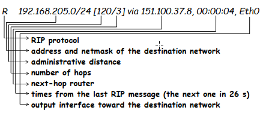

    

##### <u>RIPv2</u> 

-   **Classless Routing Protocol**;
-   In the RIPv2 messages the <u>subnet mask</u> field <u>is present</u>;
-   In the case of <u>variable **or** discontinuous subnetting</u>, **RIPv2** **doesn’t work** !
    -    In this case the *auto-summarization* should be <u>deactivated</u>;
    
-   `R (config)        # router  rip` 
    `R (config-router) # version  2 `   

-   Deactivate auto-summarization:
    `R (config-router)# no auto-summary ` 

-   Configure the default router <u>only on the border router</u> and “<u>distribute</u>” it to remaining routers using RIP:
    `R (config-router)# default-information  originate` 

### L4  -  OSPF (Open Shortest Path First)

>   March 29, 2019

-   OSPF is a <u>link-state</u> routing protocol: each network router knows the network topology. 
-   The <u>OSPF packets</u> are directly encapsulated into IP packets, with <u>protocol field</u> equal to `89`. 
-   The <u>OSPF administrative distance</u> is equal to `110`. 
-   Each router periodically send (default: `10` s) *Hello packets*, to notify its links status to the neighbors
-   Each router describes its topology generating a *Link State Advertisement* (***LSA***) packet.
-   The *LSA* is sent to all network routers using the <u>flooding technique</u>.
-   Each router has a **Global Network View** (*LSA database*) and it is able to compute the set of shortest paths (**Shortest Path Tree: *SPT***) executing the ***Dijkstra*** *algorithm*. 

>   Dijkstra complexity: $N \: log \: N$ ;

>   Stub nodes  :=   connected just to a router (*leaf nodes* | *extremity nodes* | *margin routes*);

-   **OSPF  link  cost:**

    | INTERFACE Type              | BANDWIDTH (bps) | COST $ = 10^8$ $\big{/}$ $\text{BANDWITH}$ |
    | :-------------------------- | --------------: | -----------------------------------------: |
    | Fast Ethernet   and  FASTER |     100.000.000 |                                          1 |
    | Ethernet                    |      10.000.000 |                                         10 |
    | E1                          |       2.048.000 |                                         48 |
    | T1                          |       1.544.000 |                                         64 |
    | 128 kbps                    |         128.000 |                                        781 |
    | 64 kbps                     |          64.000 |                                       1562 |
    | 56 kbps                     |          56.000 |                                       1785 |

    

##### LSA *(Link State Advertisement)*

-   An ***LSA*** is composed of a <u>*Link State Header*</u>  and  a *<u>Link State Data</u>* ; 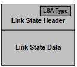

    

-   **OSPF configuration command**:  `R(config)#  router ospf id `;   ( $\text{id} \in [1 \:, \: 65535]  $ );

-    Interfaces (*and so networks*) on which **enable OSPF**: 

     ​	`R(config-router)#  network  network-address wildcard-mask`
     ​					        `area     area-number `   ($0$ - means one area) (advanced concept);

     -   `area`  := an AS can be divided into areas to solve scalability issues; area `0` is always present;

     -   `wildcard-mask`  :=  opposite of a subnet mask; 

-   Change the OSPF **cost** for an interface:  `R(config-if)#  ip ospf cost  <cost> `;

-   Show the OSPF table:  `show ip protocols`;

### L5  -  DHCP  &  NAT

#### DHCP (*Dynamic Host Config. Protocol*)

-   The DHCP (*Dynamic Host Config. Protocol*) allows to dynamically configure hosts in a LAN. 

-   Configuration parameters:
    1.  IP address  and  subnet mask
    2.  Default gateway 
    3.  DNS Server 

-   Start **DHCP config. mode**:  
    `R(config)#  ip  dhcp  pool  NAME_POOL`;
    -   `NAME_POOL` is the name used to identify the DHCP configuration on the router `R`; 

-   Define the **address pool** to be assigned dynamically: 
    `R(config-dhcp)# network NET_ADD  NET_MASK `;

-   **Exclude** an address | range of addresses for the pool:  (*do  `exit`  first*)
    `R(config)     # ip dhcp  excluded-address  <ip address to be excluded>`;

-   To provide the Internet access,  **default router** (`192.168.1.1`)  and  **DNS server** (`192.168.1.10`) must be configured:  
    -   `Router(config-dhcp)# default-router 192.168.1.1 `;  
    -   `Router(config-dhcp)# dns-server 192.168.1.10 `;

#### NAT (*Network Address Translation*)

>   **Problem**: IP addresses are not enough to assign a unique IP address to each network host/device !
>
>   -   ​                      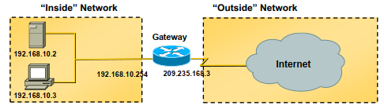
>
>   | Address Class | Number of NETs Numbers Reserved | NET Address                 |
>   | :-----------: | :-----------------------------: | :-------------------------- |
>   |       A       |                1                | 10.0.0.0                    |
>   |       B       |               16                | 172.16.0.0   - 172.31.0.0   |
>   |       C       |               256               | 192.166.0.0 - 192.168.255.0 |

-   **Advantages**:
    • No need to request public IP addresses for all the devices
    • Reduction of public IP addresses
    • Security improvement: real devices IP addresses hidden
-   **Drawbacks**:
    • Extra-load for access routers
    • Breaking of the layers separation rule 

-   Two main types of NAT operations exists (*you can use both at the same time*):

    1.  **Static NAT**: `one-to-one` translation (*one private* to *one public*) ;

        .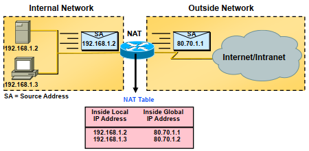

        -   Often use to configure the SERVERS in the private NET, because usually the servers requires a permanent public IP address.

            

    2.  **Dynamic NAT**: `N-to-one` translation (*N private* to *one public*);

        .

        -   It make use of the PORT FIELD (no meaning for router) of the TCP/UDP/Data header;

            

-   The router must implement NAT (*Network Address Translator - **RFC 1631***);

-   **<u>STATIC config</u>**:
    -   The first step in NAT configuration is the setting of **inside** (local)  and  **outside** (global) **interfaces**:
        -   `Router(config-if)#ip nat  inside `;
        -   `Router(config-if)#ip nat outside `;

    -   `one-to-one` translation among a private and a public IP address. 
        Used for servers. 
        Translation rule:
        -   `Router(config)# ip nat  inside  source static <private_address> <public_address>`;

    -   Show the STATIC NAT translations:  `show ip nat translations`;

​	

-   **<u>DYNAMIC config</u>**:

    -   **Private IP addresses definition**:  (*identify the private net*)
        `Router(config)# access-list <access-list-number>  permit <source_address> wildcard` 

    -   **Define the Pool of public IP addresses**:
        `Router(config)# ip nat  pool <name> <start-ip> <end-ip>  netmask <netmask>`;

    -   **Translation rule**:
        `Router(config)# ip nat inside  source list <acl-number>  pool <name>` 

    -   It is also possible to use a <u>single</u> public IP address for all the LAN hosts: *the public IP address of the router*. <u>In this case the pool of public IP addresses is not required</u>.

        **Translation rule**:
        `Router(config)# ip nat inside  source list <acl-number>  interface <interface>  overload`   (*use public access interface* )

### L6  -  VLAN

>   May 3, 2019

-   Ethernet standard (IEEE 802.3) for Local Area Network (*LAN*).

-    **CSMA/CD** (Carrier Sense Multiple Access/Collision Detection).

    -   ***Carrier Sense***: all devices have to "sense" the medium before sending frames.
    -   ***Multiple Access***: collisions.
    -   ***Collision Detection***: Back-off algorithm.

    

-   **Ethernet frame**:   

    

-   **Hub**:      forwards frames on all interfaces;

-   **Switch**: forwards frames only on the proper outgoing interface. It has a **MAC forwarding table** (*MAC learning procedure*);

    

-   The basic configuration parameters are:

    -   <u>IP address</u> and <u>subnet mask</u> (?)
        -   NO functional use; Is used just for the OS updates;
    -   <u>Default gateway</u> (?)

-   Interface management (*as for the routers*):

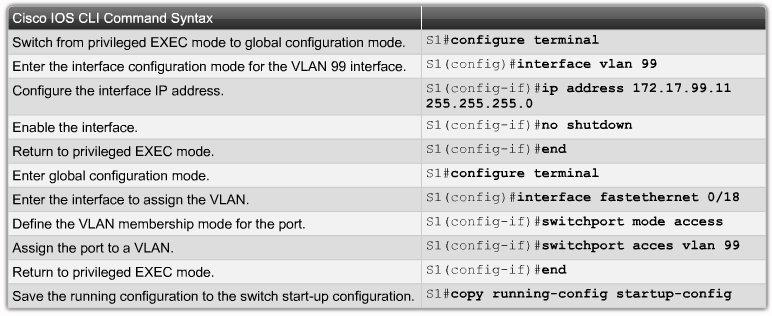

-   **VLAN**  :=  IP network sharing a physical network with different VLANs.

-   VLAN Motivations:

    1.  **One** physical infrastructure  -  **More** IP networks (*VLANs*) for different purposes;

    2.  **Security**;

    3.  Cost saving;

    4.  Reduction of **broadcast traffic** (!!!);

        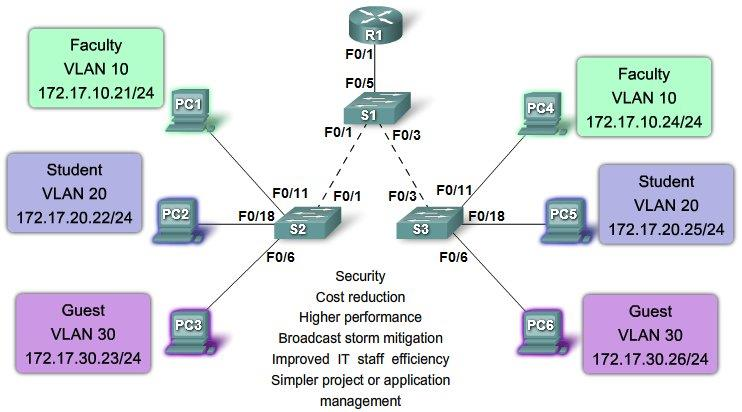

        

#### VLAN Configuration

-   Just the SWITCHES must be configured !  (*the hosts aren’t aware about the VLANs*)

    -   All the switches need to know all the VLANs available;
    -   Each VLAN is identified by a number (`1 - 1005`) with the own <u>address block</u>;

    

-   `Switch (config)#       vlan  <id-number>` 
    `Switch (config-vlan)#  name  <name>`                   (*optional*)

-   **ACCESS**  &  **TRUNK**  ports:

    -   **access port**: connected to hosts belonging to a single VLAN;
    -   **trunk port**: receiving and forwarding frames belonging to different VLANs;
    -   .      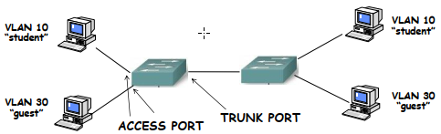

##### ACCESS port config

-   `Switch (config)#      interface   FastEthernet 1/0 `
    `Switch (config-if)#   switchport  mode  <access>` 
    `Switch (config-if)#   switchport  access  vlan  <id-vlan>` 

##### TRUNK port config

-   The frames crossing a trunk are all “*tagged*”. The only exception regards frames belonging to one <u>single VLAN</u>: **the Native VLAN**.

-   `Switch (config)#     interface   FastEthernet o/x` 
    `Switch (config-if)#  switchport  mode  <trunk> `
    `Switch (config-if)#  switchport  trunk  native   vlan  <vlan-id> `  
    
    >   NATIVE && TRUNK on the both endpoints;

-   By default the trunk port <u>forwards</u> and <u>receives</u> <u>**all**</u> <u>VLANs frames</u>. It is also possible to configure the trunk port so that only a subset of VLANs is allowed: 
    `Switch (config-if)#  switchport  trunk  allowed  vlan   <id-vlan>` 
`Switch (config-if)#  switchport  trunk  allowed  10-20 ` 

-   The <u>broadcast traffic</u> received on <u>an access interface</u> will be forwarded only on the interfaces ”*connected*” to the **same** VLAN of the <u>access port</u>. 
    .                           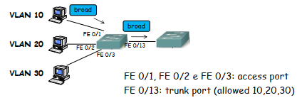

-   Lists all the VLANs configured  and  the associated access interfaces:
    `Switch #  show  vlan  brief`   (*first command - check if there are some VLANs already configured*)

##### Management VLAN

-   Usually is defined as:  `VLAN  99 `;

-   You can do a TELNET from all the PC belonging from the  `VLAN 99 `;

-   IP address of the switch must be defined here !!!

-   Configure IP:
    `Switch (conf)#       interface   vlan  <Management-VLAN-id>` 
    `Switch (config-if)#  ip address  <IP>   <NET-MASK>` 

    >Configure the IPs only on the switches that you want to access from the <u>Management VLAN</u> <u>hosts</u>;
    
-   TELNET access configuration on the target switches:
    `S (config) #  line  vty  0  15` 
    `S (config) #  password  <xyz>` 
    `S (config) #  login`                           // *to enable access* //
    // do the same commands in *enable* mode for remote $telnet$ privileged access //
    `S (config) #  enable  password  <en-password>`;   // *config privileges* (*en*) //

### L7  -  Inter-VLAN

>   May $10^{th}$, 2019

-   In a LAN with many VLANs, the communication among host <u>belonging to different VLANs</u> (*Inter-VLAN Routing*) is not possible.
-   To allow <u>Inter-VLAN Routing</u>, a router must be present;

#### Traditional Inter-VLAN

-   A **router** must be connected **to a switch** with a number of **router-to-switch physical links** equal to
    the number of VLANs able to communicate each other;
-   Each router interface is associated to a VLAN (*an <u>IP address</u> <u>of the VLAN block</u> must be assigned*); 
-   The <u>**switchports**</u> connected to the router must be <u>configured in **access** mode</u>;

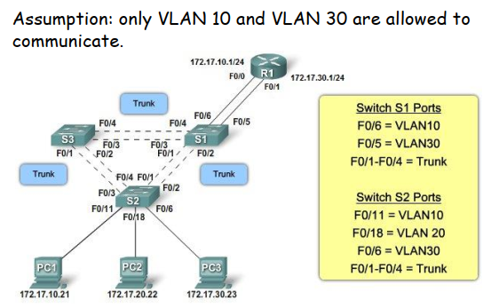

1.  Connect the router to the switch via $N$-links (where $N$ is *the number of VLANs that need to communicate to each other*);
    
2.  Configure **the switchports** connected to the router:
    `S1 (config)    #  interface   FastEthernet 0/6 ` 
    `S1 (config-if) #  swithcport  mode    access` 
    `S1 (config-if) #  swithcport  access  vlan  <VLAN-interface-ID>` 

3.  Configure the **router interfaces** connected to the switch:
    `R1 (config)    #  interface   FastEthernet 0/0` 
    `R1 (config-if) #  ip address  172.17.10.1  255.255.255.0` 
    `R1 (config-if) #  no shutdown ` 

    

    >   <u>NOTE</u>:  No routing should be configured; 

    >   <u>NOTE</u>:  **Set the default-getway on the hosts !**  

#### Router-on-a-Stick Inter-VLAN

-   A **router** must be connected **to a switch** with a **<u>single</u> router-to-switch physical link**;

-   The physical interface of the router is **splitted into virtual interfaces** (*the number of virtual interfaces is equal to the number of VLANs able to communicate each other*).

-   Each virtual interface (*sub-interface*) of the router is associated to a single VLAN (*it must have an IP address of the VLAN block*).

-   The **switchport** connected to the router must be configured in **trunk** mode;
    

    .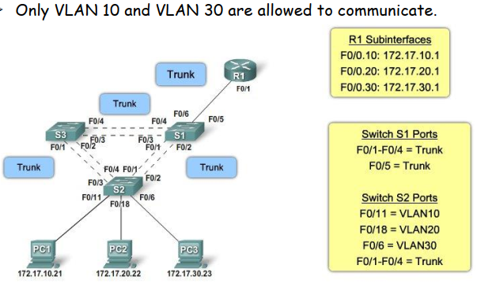

1.  Connect the router to the switch via $1$ link;
    
2.  Configure **the switchport** connected to the router:
    ` S1 (config)    #  vlan  1` 
    `S1 (config)    #  vlan  2` 
    `...` 
    `S1 (config)    #  vlan  <N>` 
    `S1 (config)    #  interface   FastEthernet 0/6 ` 
    `S1 (config-if) #  switchport  mode  trunk`  

3.  Configure the **router interface** connected to the switch (*the interfaces of the link connected to the switch must be split in $N$ sub-interfaces, one belonging to each VLAN*):
    `R1 (config)       #  interface   FastEthernet   0/0.10` 
    `R1 (config-subif) #  encapsulation   dot1q         10` 
    `R1 (config-subif) #  ip  address     172.17.10.1   255.255.255.0 `   // *Do this for each VLAN* 

    `R1 (config)       #  interface   FastEthernet   0/0` 
    `R1 (config-if)    #  no  shutdown `  

    

### L8  -  Ethernet Security

>   May $10^{th}$, 2019

#### Security attacks in LANs

-   The classical attack in a LAN is the ***MAC Address Flooding***;
-   It exploits the security weakness of MAC forwarding table learning mechanism:
    -   If an incoming frame with a new MAC source address is received, the switch <u>adds a row in</u> the <u>forwarding table</u>;
    -   If an incoming frame has a destination MAC address <u>not present in the forwarding table</u>, the switch <u>**acts as an hub**</u> (*forward all thus packets through all the other ports - broadcast*);
    -   The forwarding tables have a <u>limited size</u>;
    
-   ***DHCP Spoofing***:  a malicious DHCP server is inserted in the LAN, so that fake info (default gateway) are sent to LAN hosts. This is a <u>man-in-the-middle</u> attack;

-   ***DHCP starvation***:  attack to the DHCP servers, sending a huge amount of DHCP requests so that to use the available IP addresses. 

#### Security Ports

-   **Port Security**: option to be configured on switch interface/s to increase the security level of the network;  The idea is to limit the end devices that can be connected to a specific switch interface; 
-   The <u>security policy</u> is based on the source MAC address of incoming packets  and  on the number of different source MAC addresses <u>allowed</u> on the interface.
-   If a frame having a MAC source address not allowed is received, <u>the interface</u> switch to:
    -   ***Violation Mode***:  Shutdown by default (restrict);

-   The association among the interface and the allowed MAC address/es can be  **dynamic**  or  **static**.
    

##### STATIC Security Ports  (1)

-   The allowed MAC address/es are <u>statically configured</u> by the LAN administrator:
    `S1 (config-if) #  switchport port-security ` 
    `S1 (config-if) #  switchport port-security   mac-address  <MAC-add>` 
    
    >   terminal   $>$  `ipconfig  /all`   (*MAC - get the physical address*)

##### DYNAMIC Security Ports  (2)

-   The allowed MAC addresses <u>are learned dynamically</u> up to a fixed number  and  **saved only in the secure MAC address table**:
    `S1 (config-if) #  switchport port-security` 
    `S1 (config-if) #  switchport port-security   maximum  <N>` 

##### Sticky DYNAMIC Ports  (3)

-   The allowed MAC addresses <u>are learned dynamically</u> up to a fixed number  and  **saved in the secure**
    **MAC address table**  and  **in the running configuration file** (*so you can save the running configuration with the current security ports config.*):
    `S1 (config-if) #  switchport port-security`     //  enable1
    `S1 (config-if) #  switchport port-security   maximum      <N>`        // optional // [9 - ACL.pdf](..\..\#_LAB_NET_Design_and_Configuration\Lecture_Slides\9 - ACL.pdf) 
    `S1 (config-if) #  switchport port-security   mac-address  sticky`  

    `S1             #  copy   running-config   startup-config`                  //   save it   //

-   Show *Port Security* configuration on a certain interface:
    `S1             #  show   port-security    interface   FastEthernet  0/6 ` 
    `S1             #  show   port-security    address ` 

    >   If the dynamic security ports configuration are used, the output of the last command could be a void list because  no packet received yet at that moment.

### L9  -  ACL (*Access Control List*)

#### ACL ?

<u>**DEFs**</u>:

-   **Control lists** applied to traffic incoming in/outgoing **from a router**;
-   **Rules** to determine if packets must be <u>processed and</u> <u>forwarded</u> or <u>blocked</u> <u>and dropped</u> by the <u>router</u>;
-   Based on the:  *IP addresses* (source  or/and  destination ),  *protocol*,  *direction*,  *port*, etc...
-   Is an **ordered list** of rules:    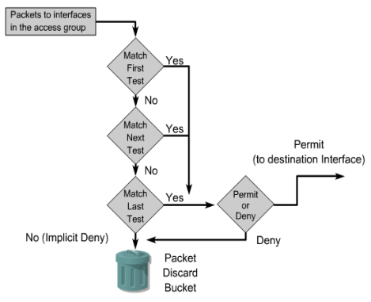

<u>**Motivations**</u>:

-   Limit the NET traffic;
-   Control the traffic flows;
-   Provides a basic level of security;
-   Allows/denies the NET access on the basis of traffic type (by protocol, by IP source/destination) [filtering];

>   **Note:  *if no ACLs are configured on a router, all the packets will be processed and forwarded***;

-   When associating an ACL to an interface specify the direction:

    -   *Inbound*     :=  incoming/reaching packets; [`in`]
    -   *Outbound*  :=  outgoing/leaving packets;    [`out`]

    

    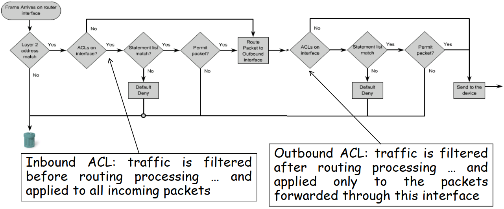

-   **The rule is that you can have a <u>single ACL per interface and per direction</u>. Thus, on the same interface you can have one ACL for the incoming and a different one for the outgoing.**  

#### Standard ACL

>   The packets filtering is based only on the source IP address. 

-   Create an ACL (STANDARD):
    `R (config)   #  access-list  <acl-nr-ID>  {deny | permit}  source [source-wildcard]`;
    
-   Remove an ACL:
    `R (config)   #  no  access-list  <acl-nr-ID>`;
    
-   Apply an ACL to an interface:
    `R (config-if)#  {protocol}  access-group   <acl-id-num>  {in | out}`;
    //  `ip`  *is the most general protocol*;  //
    
-   Standard ACL ID range:  $[1 , 99]$ ;

-   **<u>STANDARD ACLs</u> are applied to the closest <u>destination</u> port**;

    >   Standard ACL works on Source network/host. If you put near the Source, <u>you may block traffic that you did not want to block</u> (accidentally) as well as blocking intended traffic;

#### Extended ACL

>   The packets filtering is based on source and destination IP address, protocol, and destination port.

-   Create an ACL (EXTENDED):
    `R (config)   # access-list <acl-id>  {permit | deny}  <protocol>  <source>  `
    `[ <src-wld>  <destination | any | host>  <dest-mask-wildc.>  <operator> <operand> ]`
`[ established ]`;
    
>   `opertor`  $\in$  [ `lt`, `gt`, `eq`, `neq` ];
    >   `operand`  $-$  a port number;

<u>EX</u>: `access-list  101  permit  tcp  172.16.6.0  0.0.0.255   any  eq   ftp`; 
​   

-    Apply an ACL to an interface:
    `R (config-if)#  {protocol}  access-group   <acl-id-num>  {in | out}`;

-   Standard ACL ID range:  $[101 , 199]$ ;

-   **<u>EXTENDED ACLs</u> are applied to the closest <u>source</u> port**:

    >   Extended ACL when putted near the destination, let traffic that will be blocked later travel all the way from source to destination.  **Waste of bandwidth**.

#### Named ACL

>   Can be both *Standard* and *Extended*, are identified by a name and provide a more flexible configuration procedure.

-   Named ACLs can be modified with no need of starting from scratch:

    -   It is possible to **remove** a single statement  and  to **add** a new one in any position;

    

-   Create a Named ACL:
    `R (config)          #  ip  access-list  {extended | standard}  <name-acl>` 
    `R (config-ext-nacl) #  {permit | deny}  <protocol>  <source> <src-wld>` 
    `---------------------- [operator [port] ]  <destination> <dest-wld> [ operator [port] ]` 
    `---------------------- [established]`
    `R (config-if)#  {protocol (ip)}  access-group   <acl-name>  {in | out}` ;

 

-   Change a Named ACL:
    `R (config-ext-nacl) #  no 20` 																		 // *remove it*
    `R (config-ext-nacl) #  20  permit  ip  host  192.168.1.77  any`   // *change it*
    `R (config-ext-nacl) #  25  deny    ip  host  192.168.1.88  any`   // *add a new one*
    `R (config-ext-nacl) #  end` 																			 // *exit*
    `R #  show  access-lists`																					// *check it out* 

    

#### General rules

-   **The STANDARD ACLs should be placed as close as possible to the <u>destination</u>**.
    (since it is not possible to specify the destination);
-   **The EXTENDED ACLs should be placed as clos as possible to the <u>source</u>**.
    (to filter earlier the traffic, and so reducing routers work);

-   Limiting the **TELNET** access with a **standard ACL**: 

     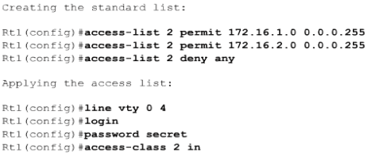

